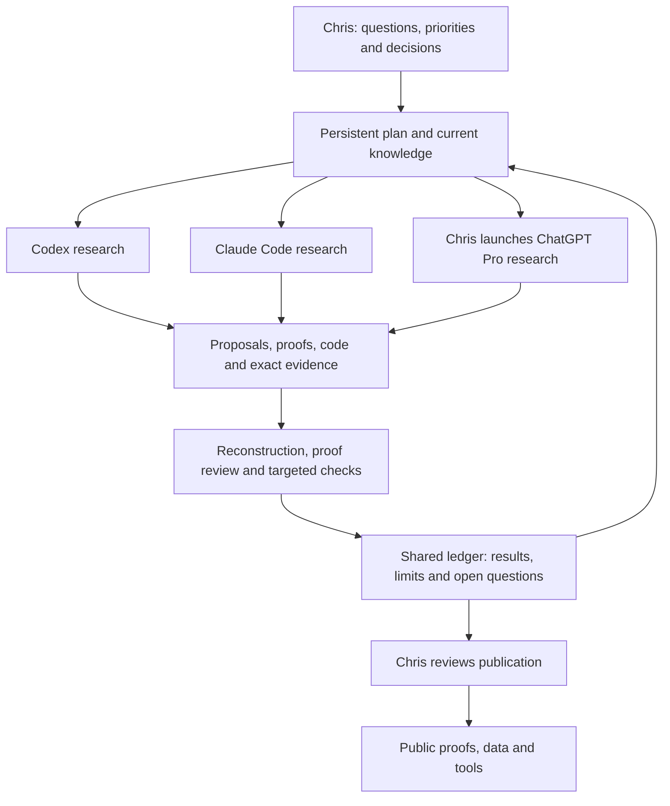

# AI assistance and the research process

This research has been developed since July 2026 through sustained collaboration
between Chris Hadad and several AI models, working across Codex, Claude Code
and the ChatGPT app. AI systems have contributed substantial mathematics:
proposed constructions, conjectures, counterexamples to intermediate claims,
proof arguments and exact computational methods. They have also built software,
challenged proposed results and assembled the evidence published here.

Chris serves as research director. He sets the questions and standards, steers
the program, selects and coordinates the research environments, allocates
resources and decides what to share. The resulting work combines human
direction with extensive AI-originated research and machine-executed exact
computation.

This account covers July through **14 September 2026**. It summarizes the
project's working records and Chris's model and session history. The
[provenance page](PROVENANCE.md) gives result-specific contributions and
independence limits; [METHODS.md](METHODS.md) explains the mathematical route
to the finite-box proof. The linked proofs and verification records supply
the evidence for individual results.

- [How the program developed](#how-the-program-developed)
- [Models and research environments](#models-and-research-environments)
- [Chris's role as research director](#chriss-role-as-research-director)
- [Persistent plans and the shared ledger](#persistent-plans-and-the-shared-ledger)
- [Working with external model sessions](#working-with-external-model-sessions)
- [Mathematical tools and tools built during the research](#mathematical-tools-and-tools-built-during-the-research)
- [How a proposal becomes a research result](#how-a-proposal-becomes-a-research-result)
- [Examples of the combined process](#examples-of-the-combined-process)
- [What has worked and what required correction](#what-has-worked-and-what-required-correction)
- [Attribution and the limits of this account](#attribution-and-the-limits-of-this-account)

## How the program developed

**July: turn a counterexample question into a continuing research program.**
The starting objective was to find a negative ordinary coefficient of a
stretched Littlewood–Richardson polynomial, initially within the posted
FrontierMath bounds. A formal campaign was organized on July 22 from Chris's
research playbook. Early work established partition conventions, exact
evaluation and independent checking, while pursuing different ways to find a
promising input. By July 23, Chris had explicitly directed Codex to originate
hypotheses, implementations, generators and falsification experiments, alongside
external model research. Repeated sessions were expected to accumulate
understanding and preserve useful failures.

**August: develop constructions, instruments and a more explicit record of
what had actually been established.** Broad searches produced bounded negative
results and exposed the cost of exact counting. The research increasingly
emphasized structured families, geometry, coefficient mechanisms and
constructions that might produce a decisive example. The program also made
the alternative finite objective explicit: a complete certificate of
positivity in the original box would answer that bounded question. Search,
structural mathematics and development of faster exact instruments continued
as complementary activities. Plans and handoffs became more precise about
which computations had run, which statements were only proposals and what
would justify revisiting a route.

**September: integrate the research lanes and build proofs from their
combined evidence.** A campaign-wide reassessment strengthened the common
research framework. Codex and the Claude-based research environment could
both originate mathematics on any part of the problem; ownership of files
and running jobs remained explicit. A shared campaign ledger brought accepted
results, active ideas, abandoned or deferred approaches and next actions
into one current overview. Sustained GPT 6 Pro work in the ChatGPT app added
constructions, proof developments, data and programs, which the local research
environments could investigate and check.

The original search eventually yielded a
[computer-assisted positivity proof for the complete finite box](results/finite-box/README.md).
The broader program continues: the
[rank-six fourth- and fifth-coefficient result](results/rank-six-coefficients/README.md)
is a further partial advance, while unrestricted positivity and an ordinary
negative coefficient outside the proved box remain open. These outcomes
required changes of mathematical strategy as well as more computation.

## Models and research environments

A model supplies reasoning; its research environment supplies access to
instructions, files, tools and persistent working state. That distinction
matters here because the same overall program has used several environments
and several generations of models.

| Environment | Models used in this program | Main kinds of work |
|---|---|---|
| Codex | GPT 5.6 and GPT 6 | Original mathematical research, literature investigation, experiment and tool design, exact computation, proof reconstruction, review and integration of the research record |
| Claude Code | Fable 5 and Fable 5.1 | A continuing mathematical research lane, including geometric and counting methods, structural families, computational experiments, software development and criticism of proposed arguments |
| ChatGPT app | GPT 5.6 Pro and GPT 6 Pro | Human-launched research sessions with prepared mathematical context; constructions, extended proof development, challenges to the current approach, numerical data and proposed programs |

The non-Pro models were used at **xhigh or max**, depending on the session.
Those are the research settings used in this program. The table is a roster
across the period, not a claim that every model was available or used from
the beginning. Earlier external Claude tasks also formed part of the evolving
workflow; the table describes the principal research environments rather
than every historical delivery route.

The roles overlap. Codex has originated arguments as well as checked them,
and Claude-based work has supplied both mathematical ideas and working
instruments. Pro sessions have contributed executable proposals as well as
prose. Assignments follow the question, the available tools and the need for
a fresh approach. A result's specific attribution belongs with that result;
it cannot be inferred just from the application in which a later check ran.
The Claude-led environment has also used Codex coding and review seats, so
even a single local research lane can contain contributions from both model
families.

## Chris's role as research director

Chris maintains the purpose and continuity of the program across model
changes and separate conversations. His contribution includes:

- **Setting the objective and deciding its scope.** Preserve the original
  bounded question while pursuing broader constructions, positive families
  and possible counterexamples outside it.
- **Directing the research portfolio.** Challenge premature narrowing,
  request alternative approaches and strategic audits, and make room for
  open-ended mathematical exploration alongside planned computations.
- **Setting standards for accepting claims.** Require exactness, explicit
  hypotheses, meaningful independent checks and a distinction between a
  searched region, a proved family and an unrestricted theorem.
- **Designing and maintaining the working conditions.** Develop the plan
  systems and research instructions with AI assistance, choose model and
  effort settings, supply computational resources and adjust allocations
  when the evidence supports a stronger route.
- **Connecting separate research contexts.** Launch external sessions with
  the reviewed inputs, bring back their outputs, and steer follow-up work
  while other research continues.
- **Taking responsibility for communication.** Review proposed public
  updates, decide publication and outreach, and handle human collaboration
  and authorship decisions.

Within an agreed session, the agents make routine research and implementation
decisions, pursue leads, diagnose failures and propose changes of course.
Chris intervenes at strategic choices and can redirect work as it proceeds.
Research direction does not mean that he has independently verified every
proof step or manually performed the computations. Much of the detailed
mathematical development and checking is AI-assisted, as the result-specific
records describe.

## Persistent plans and the shared ledger

The local environments are supported by two custom, file-based research
harnesses. Here, a harness means the combination of instructions, plan
documents, tools, review procedures and session records that lets an agent
carry out sustained work. One is adapted to Codex and another to Claude Code.
Their procedures have evolved during the project.

The durable plan contains the research objective, current strategy and
numbered work items. A session starts from a bounded handoff identifying
the current mathematical state, required source material, concrete work,
verification obligations, resource constraints and stopping point. At its
end, the agent records the result, the evidence and remaining uncertainties,
then leaves an executable handoff for a fresh session. Code and accepted
artifacts are versioned in Git.

This gives a new conversation a way to resume a precise question without
reconstructing the whole project from chat history. The current summary
points to proofs, data and earlier decisions; it does not replace them.
An approach that failed because a computation timed out remains different
from an approach disproved by a counterexample. Deferred ideas retain the
condition or experiment that could make them useful again.

The shared ledger now provides a common view across the research lanes:

| What it records | Why it matters |
|---|---|
| Core goals and their current status | Completion of the original box does not close the unrestricted conjecture |
| Accepted statements, hypotheses and evidence links | Later work can identify exactly which result it may use |
| Proposed, active, deferred and unsuccessful ideas | Promising alternatives and useful failures survive session changes |
| Outstanding computations, proof gaps and dependencies | An omitted or incomplete task cannot silently become an established fact |
| Source origins and subsequent checks or corrections | Sharing a result preserves credit and its verification level |
| Immediate next actions and compact session history | Both research environments can work from a coherent current picture |

Codex maintains this shared overview by reconciling the research plans and
the Claude lane's own records and handoffs. Each lane retains responsibility
for its native execution records, files and running jobs. A statement copied
into the common view keeps its original status until the required checking
supports a stronger one. The underlying knowledge records also preserve
earlier source versions when a result is refined or superseded.

The following diagram shows the current broad organization. Individual tasks
can take different routes, and explicitly independent investigations receive
separate inputs.

## Working with external model sessions

External research is prepared as a self-contained mathematical assignment.
A packet supplies the question, relevant definitions and prior results,
known obstacles, available evidence and requested outputs. Some assignments
target a specific missing proof or construction; others deliberately invite
new approaches. Longer missions can be divided into explicit units with
intermediate records and a complete return package.

Chris launches these sessions in the intended application with the chosen
model and effort, then returns the resulting material for local integration.
The ChatGPT Pro lane is human-mediated; the local agent does not silently
invoke it as another command-line worker. Independent local research can
continue while an external assignment is running.

On return, the original material is preserved with its source identity.
Intake records distinguish a received proposal from an accepted result and
check that the intended files are present. Arguments, numerical claims,
programs and suggested experiments are then examined at their own scopes.
Useful ideas can become new local work items; rejected claims can still
identify a valuable obstruction or a better question.

The information boundaries have changed with experience. Some earlier
exchanges used strict separation of provider material. Ordinary research
memos can now be shared after preservation, allowing direct intellectual
collaboration. Special separation remains for explicitly paired independent
investigations and bare-input candidate checks. A reviewer who has seen a
proposed proof is described as reviewing or reconstructing it; that is a
different claim from deriving an answer without seeing it.

## Mathematical tools and tools built during the research

Language-model reasoning is combined with exact mathematical software. The
research has used SageMath with `lrcalc`, SymPy, polyhedral and lattice tools
including PPL, Normaliz and Barvinok-based methods, and project-specific
Python and C++ programs. Different tools answer different questions: counting
tableaux, describing a hive's geometry, enumerating integer points,
reconstructing a polynomial or checking a finite certificate.

The project has also developed reusable instruments when a general method
was too expensive or did not expose the right mathematical structure:

- **Exact counting algorithms.** Tableau recurrences, state aggregation,
  transportation counters, flow methods and specialized formulas for proved
  families replace repeated general-purpose enumeration where justified.
- **Whole-object constructions.** Maps between tableaux, hives, flows,
  transportation tables and related lattice models retain the complete count
  and its integer lattice. This matters because a negative face or auxiliary
  polynomial need not make the entire LR polynomial negative.
- **Polynomial and sign tools.** Exact integer and rational arithmetic,
  proved degree bounds, interpolation and unused evaluation points connect
  finite counts to full polynomial statements. Reciprocity and rigorous
  bounds can sometimes settle coefficient signs with fewer exact counts.
- **Geometry and certificate checkers.** Programs reconstruct affine hulls,
  saturated lattices, inequalities, incidences and finite coefficient
  certificates, then check the premises actually needed by the proof.
- **Experiment and evidence tools.** Input manifests, hashes, reproducible
  commands, runtime records, completeness checks and source maps tie a
  reported result to the exact objects and programs that produced it.

Tool development is itself part of the research. A faster count can make a
previously inaccessible test possible; a better representation can reveal a
proof. The [public tooling collection](tooling/README.md) exposes selected
instruments with their mathematical domains and failure behavior.
[Benchmarks](tooling/BENCHMARKS.md) compare exact outputs on specified inputs
and distinguish counting time from process overhead. Those measurements
support particular algorithmic improvements, with explicit limits on
generalization.

The published checks have different dependency requirements. Many small
examples use only Python's standard library; larger modules require native
compilation or additional libraries. [REPRODUCING.md](REPRODUCING.md) states
what each route checks, its dependencies and which executions have actually
been completed.

## How a proposal becomes a research result

The central discipline is to make the mathematical claim and the evidence
match. In a typical substantial result, the work proceeds through:

1. **State the object and claim exactly.** Fix partition conventions, the
   coefficient basis, the legal domain and whether the object is an entire
   LR polynomial, a face, a quotient or another construction.
2. **Develop a derivation or experiment.** Produce the proposed proof,
   explicit input, count model or finite certificate, with the assumptions
   on which it depends.
3. **Choose a check that could expose an error.** Use another counting
   representation, a separately written implementation, a fresh derivation,
   exact arithmetic, a boundary case or a counterexample to an intermediate
   assertion. The form of independence is recorded.
4. **Check completeness where the conclusion needs it.** A finite theorem
   must account for every required input and its remaining complement.
   Correct values on a sample, or matching totals without matching objects,
   are insufficient.
5. **Review and disposition the findings.** Consequential claims and code
   receive focused challenge. Findings are repaired, rejected with reasons
   or retained as explicit limitations. Changed assumptions receive the
   corresponding verification.
6. **Integrate the result at its supported scope.** Preserve the original
   source, record what was independently checked, update the current
   mathematical state and prepare public proof, data and tools when ready.

The resulting labels matter. A conjecture, a fitted pattern, a bounded search
with no negative found, a reproduced computation and a theorem under stated
premises support different next steps. A timeout supplies no mathematical
value. A checksum establishes file identity; a software validator establishes
the conditions it actually checks. Neither establishes a theorem by itself.

## Examples of the combined process

**An exact root-location result with a genuinely blind reconstruction.**
GPT 6 Pro proposed the
[rank-eighteen Hurwitz-instability example](results/hurwitz-counterexample/README.md).
A fresh verification context received only the ordinary LR triple and the
outer-partition convention. It derived the counting method and degree bound
and fixed the reconstructed polynomial before comparison with the proposed
coefficients. Exact root certificates then established the claimed root
behavior. All ordinary coefficients are positive: this answers a root-stability
question and leaves KTT coefficient positivity intact.

**A finite-box proof assembled from mathematics, exact counts and complete
coverage.** GPT 6 Pro supplied much of the proof development, numerical data
and initial programs. Codex developed separate exact checkers, recounted
numerical premises, rederived consequential arguments and assembled the
complete verification, building on earlier Codex and Claude work. Prior
mathematics, especially Alper Ferudun's all-size theorem through rank five,
remains an explicit dependency. The
[method account](METHODS.md) shows how whole-count reductions, true-interior
geometry and sign-completion bounds were combined, with complete polynomial
vectors used for the difficult remainder. These verifiers saw the proposed
proofs and data; their independence is in the implementations and reasoning
checks, with shared premises stated.

**A useful theorem emerging from tool and model exchange.** Count formulas
proposed by GPT 6 Pro became inputs to further Codex mathematics, including
the slope-three sign proof and the homogeneous transportation
linear-coefficient argument. Earlier Claude-developed chart functions also
provided comparison implementations for selected tools. The
[contribution record](PROVENANCE.md#mathematical-and-implementation-contributions)
and [implementation sources](tooling/SOURCE-LICENSES.md) distinguish the
original formulas, later arguments and algorithms used for comparison.

The exchange also improved a difficult skew-tableau counting problem. A
horizontal-strip method emerging from native research review led to fresh
scalar counts and an independently implemented maintained counter. The
[skew-count benchmark record](tooling/BENCHMARKS.md#skew-tableau-counting)
reports exact agreement and measured improvements on those inputs, while
keeping the corresponding full high-degree polynomials uncomputed.

**Universal coefficient bounds checked through finite certificates.** The
[rank-six c4/c5 result](results/rank-six-coefficients/README.md) combines a
mathematical compensation argument with exact finite fields. The portable
verifier reconstructs the relevant local constants and geometry and checks
the complete inequalities. The proof explains why those finite predicates
apply at every area and boundary. Remaining lower coefficients are left
open, and certificate-rechecking cost is reported separately from discovery
cost. This illustrates why a useful public result needs both an argument
and a way to inspect its finite premises.

## What has worked and what required correction

**Continuity has made the research cumulative.** Persistent plans, exact
source references and the shared ledger let a new model session resume an
unfinished argument, reuse a proved construction or revisit a failed route.
They also make it possible to correct the current view without erasing how
an earlier conclusion was reached.

**Different contexts are useful when they produce different checks.** A new
model or session can suggest a construction that another missed, challenge
an assumption or find a simpler algorithm. Agreement becomes more informative
when it comes with a separate derivation or counting representation. Models
can still share mistakes, inherited premises and framing.

**Failures have improved both the mathematics and the instruments.** An
early externally reported large scan lacked the reproducible evidence needed
for acceptance and was excluded from accepted coverage. Later work found
that an oversized affine chart could give the wrong notion of interior,
and that an insufficiently constrained split in a bound certificate could
miss an integer point. The checks were strengthened accordingly. Auxiliary
negativity repeatedly required a separate argument before it could say
anything about a whole LR polynomial. [METHODS.md](METHODS.md#failures-that-changed-the-verification)
records concrete failures and their resolutions.

**Strategic correction has mattered as much as persistence.** Larger searches
did not automatically answer the question. The useful shifts included
structured constructions, exact geometric models, sharper sign bounds and
eventually exhaustive proof coverage of the original box. Chris also directed
reassessments when the workflow became too focused on administration or a
narrow route. The plan system supports these changes by retaining reasons,
alternatives and clear next experiments.

**The process has costs and unfinished work.** Context transfer, checking
external returns, expensive counts and reconciliation of large evidence sets
consume time. Some approaches timed out or never reached a decisive test.
Some historical results still lack a complete portable replay. Their public
pages retain those limitations. The value of the harness is judged by the
mathematics and usable instruments it enables, rather than the volume of
plans, reviews or stored records.

## Attribution and the limits of this account

This page describes an evolving research practice, with substantial AI
contributions and human direction. It does not assign percentages of credit
or rank the models: their tasks, context, tool access and available compute
differed, and the workflow changed during the period.

The work depends on established mathematics and the researchers cited in
[REFERENCES.md](REFERENCES.md). AI-generated arguments and programs do not
alter those dependencies. [PROVENANCE.md](PROVENANCE.md) records specific
contributions, source versions and the different meanings of independent
verification. The research-note author list remains under consideration;
describing model contributions here does not assign authorship to AI systems.

Independent AI review and independently written checking programs provide
valuable evidence within their stated scopes. External human mathematical
review and assessment of novelty remain sought. Readers can evaluate the
published proofs, reproduce the available checks and identify precisely where
a result relies on a cited theorem or a retained historical computation.

[Back to the main README](README.md) · [Results and open questions](RESULTS.md) ·
[Reproduction guide](REPRODUCING.md)
