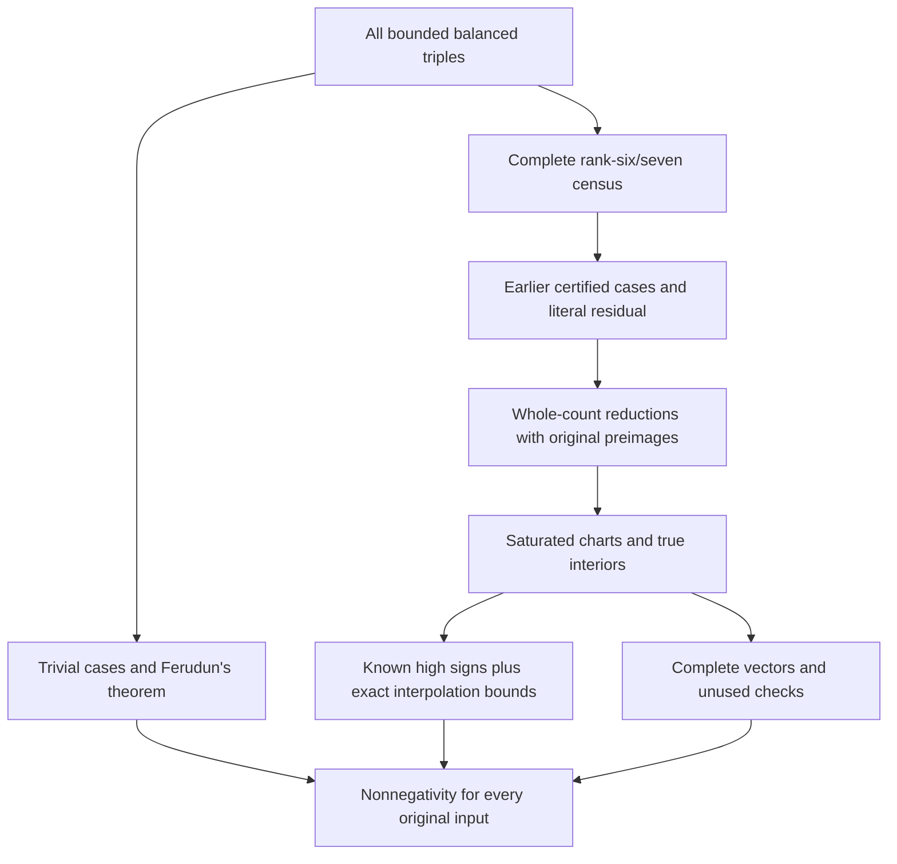

# Ordinary-coefficient nonnegativity for Littlewood–Richardson stretching through length seven and area thirty

Research-note draft, 13 September 2026. Prepared within Chris Hadad's
AI-assisted research project; contribution and verification roles are given in
[PROVENANCE.md](../PROVENANCE.md). External mathematical review is sought.

## Abstract

We give a computer-assisted proof of ordinary-coefficient nonnegativity for
every stretched Littlewood–Richardson polynomial whose three partitions have
length at most seven and whose outer partition has area at most thirty.
Alper Ferudun's all-size positivity theorem through length five is a central
external premise. The remaining finite calculation combines exhaustive domain
reduction, whole-tableau bijections, tensor and Horn identities, saturated hive
charts, relative-interior reciprocity and exact coefficient inequalities.
Many terminal proofs bound one unknown interior count instead of computing
the entire polynomial. Complete vectors settle the final remainder. The
distribution provides the finite input corpus, exact verification programs
and a record separating completed exhaustive replay from partial interface
checks. The result excludes the counterexample requested in the posted
FrontierMath box; it does not prove the unrestricted positivity conjecture.

## 1. Question, conventions and theorem

For partitions λ, μ and ν with $|\lambda|=|\mu|+|\nu|$, let

$$P_{\lambda,\mu,\nu}(t)=c^{t\lambda}_{t\mu,t\nu}\qquad(t=1,2,\ldots).$$

Stretching polynomiality is prior mathematics of Derksen–Weyman and Rassart;
it is not a conclusion inferred from a finite interpolation. We write
$P(t)=\sum_j c_jt^j$ in the ordinary monomial basis. The values $P(t)$ are LR
multiplicities; the rational numbers $c_j$ are different objects. Their
nonnegativity is the King–Tollu–Toumazet conjecture.

**Theorem.** If

$$|\lambda|=|\mu|+|\nu|\leq30,\qquad
\max\{\ell(\lambda),\ell(\mu),\ell(\nu)\}\leq7,$$

then every ordinary coefficient $c_j$ is nonnegative.

Here λ is outer and lengths are measured after removing trailing zeros. For
an empty positive-stretch family we use the zero polynomial, independently
of the isolated value $c^0_{0,0}=1$ at stretch zero. A nonempty hive has
$P(0)=1$. The all-empty triple has polynomial one; an empty inner partition
gives the usual zero-or-one rule. Noncontainment gives zero. These cases are
part of the theorem, not discarded inputs.

Ferudun's theorem closes all triples of length at most five at arbitrary
area. The finite calculation below handles the original rank-six/seven
domain. The precise adopted theorem is the length-five manuscript at
[revision c3a0795](https://github.com/AlperTheKing/ktt-positivity/blob/c3a0795bd287dcca78fac2cc6ba4282144bb7813/paper/ktt_positivity.tex),
with public reference [arXiv: 2607.22301v2](https://arxiv.org/abs/2607.22301v2).
Its earlier coefficient inputs and external-generator reproduction limitation
remain explicit in the [dependency account](../results/finite-box/DEPENDENCIES.md).

## 2. Architecture of the finite proof

The logical structure has three obligations: enumerate the original domain
completely; show that every reduction preserves the whole sign question;
and prove every coefficient sign at each required terminal. The finite
identity joins connect these obligations. Numerical totals provide useful
checks but do not replace equality of the underlying sets.

The original census contains 651,229,702 rank-six/seven identities. After
earlier sufficient theorems and finite certificates, its remaining list has
3,936,015 evaluation keys representing 4,360,228 original obligations. The
distinction arises because exact symmetries and reductions can give an
evaluation key several original preimages. Every preimage weight, rank and
triple is retained. These are not counts of independently sampled polynomials.

The exported predecessor code regenerates the original census and its
finite classification premises; downstream verification reconstructs the
literal residual from all sixteen shards. The two checks are separate.
The complete finite premises and source proofs are linked from
[the detailed proof](../results/finite-box/PROOF.md).

## 3. Reductions preserving the whole counting problem

**Inactive gaps.** Delete empty skew rows. For consecutive remaining rows with
lengths $r_i$ and inner gaps $\delta_i$, replace each gap by
$\min(\delta_i,r_{i+1})$ and translate the bottom row to start at zero.
The partition inequalities survive. An overlapping pair of rows keeps its
gap; a nonoverlapping pair remains nonoverlapping. Moving each row with its
entries preserves all row/column comparisons, content, the reading word and
ballot conditions. Restoring its previous position is the inverse. Because
$\min(t\delta,tr)=t\min(\delta,r)$, this is a bijection at every positive
stretch, not a coincidence of initial counts.

**Tensor symmetries and determinant twists.** Express the LR coefficient as
the invariant multiplicity of μ, ν and the dual of λ. Permuting the factors,
simultaneously dualizing, and balancing determinant twists give exact
identities. Each stored reduction word is checked to produce legal partitions
with the specified outer factor and shifts.

**Positive dilation.** If a common divisor g is removed, then $P(t)=Q(gt)$.
The coefficient of $t^j$ is multiplied by $g^j>0$, so signs are unchanged.
Reduction words record this scale and strictly decrease their stated order.

**Proper Horn factorization.** For a feasible parent on a multiplicity-one
Horn facet, the LR coefficient factors into its two complete selected-index
coefficients. The index sets and tight equality survive stretching. An
infeasible parent instead has zero positive-stretch polynomial. The proof
uses this sign implication with the feasibility qualification; it does not
assert an unconditional factorization for arbitrary infeasible data.

Each operation is verified on every literal residual identity. A canonical
hash alone would not prove its mathematical semantics or preserve the
original domain.

## 4. The correct lattice and relative interior

The rank-n conventional hive has $D=(n-1)(n-2)/2$ unfixed coordinates and
$3n(n-1)/2$ original rhombus inequalities. After boundary equalities and
proved forced equations, a chart is written

$$h=tb+Tz.$$

The integer b and T, a coordinate-selection inverse and full-rank checks
establish the complete relative integer lattice. Further forced equalities
come from exact nonnegative combinations of the full inequalities, and
elimination retains an explicit integer inverse. Every original inequality
is then substituted. An independent tableau-row construction checks the
two-way map to the whole LR system.

For an interior request, a positive-grade integer point strictly satisfying
every remaining nonconstant inequality establishes the actual dimension d.
This is essential: strictifying an upper-dimensional chart with hidden forced
equations need not give the true relative interior. A degree upper bound is
enough for a full-vector closed-count interpolation, but it does not justify
interior reciprocity with a guessed parity.

For the nonempty period-one hive, Ehrhart reciprocity gives

$$P(-t)=(-1)^d I(t),$$

where I counts the true relative interior in the original lattice. Rational
hive vertices are allowed. The argument uses stretching polynomiality, not
an assumption that every hive is a lattice polytope.

## 5. Proving signs with incomplete polynomial information

Known geometric formulas protect the leading coefficients under their exact
dimension, lattice and metric hypotheses. In particular, the verified
short-normal criterion protects $c_{d-2}$ when each primitive facet normal in
the saturated chart has squared norm at most six in the fixed metric. Together
with the leading two coefficients, it protects the top three signs. For
rational vertices, one may dilate to a lattice polytope and transport signs
back using period-one polynomiality. The criterion is checked wherever used.

For degree five, put $A=P(1)$, $B=P(2)$, $U=I(1)$ and $V=I(2)$. Expanding
ordinary monomials and applying reciprocity gives

$$24c_2=16(A-U)-(B-V)-30,$$

$$60c_1=30A-3B+60U-15V+20+2I(3).$$

If the explicit part of the second right-hand side is nonnegative, the
nonnegativity of $I(3)$ suffices for $c_1$. The separate $c_2$ test and protected
top three signs then prove the whole polynomial nonnegative. Dropping an
unknown nonnegative term yields a sufficient bound, not an equality with zero.
An earlier weaker expression can fail even when the polynomial is positive.

As an arithmetic illustration, the lattice-simplex polynomial
$P(t)=\binom{t+5}{5}$ has $A=6$, $B=21$ and $I(1)=I(2)=I(3)=0$. The identities
give $c_1=137/60$ and $c_2=15/8$. This example illustrates the method; it is
not asserted to be a new LR instance. The small
[exact program](../examples/sign_completion.py) derives the identities for
an arbitrary quintic and checks these fractions.

In later layers take d+1 signed interpolation nodes, leaving one negative
node uncomputed. Lagrange interpolation, $P(0)=1$ and reciprocity give

$$P(t)=Q(t)+ZK(t),\qquad c_j=q_j+k_jZ,$$

where Z is the missing integer interior count. For $k_j>0$, sign positivity
requires $Z\geq\lceil-q_j/k_j\rceil$; for $k_j<0$ it requires
$Z\leq\lfloor-q_j/k_j\rfloor$; for $k_j=0$ it requires $q_j\geq0$.
All arithmetic is rational and all rounding exact. Complete counting bounds
place the true Z in an interval satisfying every required inequality. The
interval need not collapse to one value: it proves signs without claiming
to determine the entire polynomial.

## 6. Bounds, recounts and final vectors

An upper-bound certificate starts from a proved enclosing integer box for
the full fixed-grade system. Exact linear implications tighten coordinates.
Each split at an integer m partitions an interval into $[l,m]$ and
$[m+1,u]$; every branch is verified. Leaves are infeasible or carry valid
upper counts. A fractional split can omit an integer point and is rejected.
Lower certificates instead use explicitly disjoint feasible boxes, intervals
or full low-dimensional fibers, checking every original inequality.
Unvisited points add nothing to a lower bound and are never declared absent.

An independently written counter reconstructs each required value from the
complete integer H-system. It uses exact propagation, disjoint splits and
complete constraint support for component products. Overflow, time limits
and work refusals return no value. Source versions, original triples, grades,
strictness and responses are bound to their actual observations.

The final 495 targets use full vectors: 344 of degree eleven and 151 of degree
twelve. They have 6,091 positive coefficients through actual degree, 5,596
nonzero determining sites, 495 known zero-grade values and 990 unused positive
checks. There are 368 distinct vectors, but all 495 object identities remain
required. Their smaller distinct-vector count cannot replace that roster.

For an earlier vector class, the determining nodes were retained while a
deterministic first-two-unused-positive-grades rule replaced large held grades
for forty parents. All 1,854 retained original sites and eighty replacements
were freshly checked. The old larger-grade observations and incomplete extra
attempts remain supplemental. This is a documented change of verification
scope, not an assertion that the old failed attempts completed.

## 7. Exhaustive composition and the conclusion

The required proof roster contains 624,314 exact terminal identities:
620,370 production records, 169 earlier vectors, 3,478 earlier certificates
and 297 inherited whole polynomials. The production recount alone checks
3,540,291 physical sites. Each terminal is joined to its original whole
triple, proof source, geometry and numerical predicates. The final replay
checks the exact identity union and the complement, every rewrite word and
scale, and all original preimage weights.

The nine disjoint first-cover stages account for respectively 479,379;
1,190,913; 1,223,503; 612,637; 280,195; 113,471; 31,616; 3,767; and 534
residual keys. Their sum is 3,936,015. The detailed proof gives the parallel
original-obligation column, summing to 4,360,228. These totals summarize
the literal joins; they do not establish them on their own.

Every original input therefore has either a trivial or cited lower-rank
proof, an earlier checked finite certificate, or a complete chain of
whole-count reductions ending in verified nonnegative polynomials or sign
certificates. Products and positive dilations preserve nonnegative ordinary
coefficients. This proves the theorem at its stated finite scope.

## 8. Reproducibility and the remaining mathematical questions

The [verification guide](../REPRODUCING.md) and
[machine-readable record](../results/finite-box/REPLAY.json) distinguish
completed exhaustive export replay, inventory checks and representative
fresh counts. The full convenience command has not itself been run end to
end; its component replay and targeted interface tests are the actual evidence.
The exact corpus is supplied in ten archives. Full replication needs the
documented compiler and substantial disk space, and retains the universal
theorems as cited premises.

The work was substantially AI-assisted in ideas, proofs, code and checking.
The verifiers of this finite proof saw the proposed mathematics and data;
independent programs and model reviews are not described as blind human
review. [METHODS.md](../METHODS.md) explains the useful failures and repairs.
External expert scrutiny, novelty and FrontierMath's disposition are separate.

The finite box is now a proved exclusion under these premises. At ranks six
and seven a possible counterexample must have outer area greater than thirty;
higher ranks lie outside the theorem's length bound. No larger box is known
here to contain a negative coefficient. Whole-rank-six positivity, uniform
versions of the sign-completion inequalities and complete parameter-chamber
arguments remain serious proof directions. Any counterexample construction
must preserve an entire LR count, including all caps and cancellations.
The [companion outline](families-and-compensation.md) connects the structural
results to these questions without turning partial results into an unrestricted
theorem.

## References and supplementary material

The [bibliography](../results/finite-box/REFERENCES.bib) includes
Derksen–Weyman and Rassart on polynomiality; Knutson–Tao and
Knutson–Tao–Woodward on saturation and the LR cone; Pak–Vallejo on the
polyhedral models; King–Tollu–Toumazet and Ressayre on factorization;
Macdonald on reciprocity; Berline–Vergne on local Euler–Maclaurin theory;
and Ferudun on positivity through rank five and correction methods.
[REFERENCES.md](../REFERENCES.md) explains the particular dependencies and
related work, including Alexandersson's counting methods. The proof does not
claim these established tools as new contributions.

Supplementary materials are the detailed proof, original mathematical source
documents, finite data archives, exact checker sources, file manifests and
reproduction records linked above. Cite a precise repository commit and data
release so that later presentation changes do not obscure the checked version.
