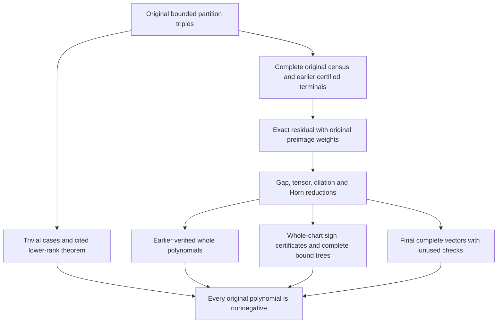

# Ordinary-coefficient nonnegativity in the length-seven, area-thirty box

Computer-assisted proof, 12 September 2026. Complete numerical replication,
all 624,314 terminal bindings and the final exhaustive residual composition
pass. Independent mathematical and scientific implementation review is complete.
The separate distribution checks are recorded in
[the current module status](README.md). The source arguments are preserved under
`proofs/sources/`, with exact identities in `SOURCE-MAP.json`.

## Statement and conventions

Let λ, μ and ν be partitions, with λ the outer partition, satisfying

`|λ| = |μ| + |ν| <= 30` and `max(length(λ),length(μ),length(ν)) <= 7`.

Lengths are measured after trailing zeros are removed. Write `P(t)` for the
polynomial agreeing with `c^(tλ)_(tμ,tν)` at every positive integer t. The
finite theorem is that every coefficient of P in ascending ordinary
powers of t is nonnegative. It follows that the counterexample requested under
the [posted FrontierMath bounds](https://epoch.ai/frontiermath/open-problems/stretched-lr-coefficients)
does not exist. This does not prove the unrestricted KTT conjecture or positivity
at every size in ranks six or seven.

An empty positive-stretch family has the zero polynomial. This convention is
separate from the isolated zero-stretch coefficient `c^0_(0,0)=1`. A nonempty
hive polytope has `P(0)=1`, which may be used in interpolation. The empty outer
partition itself gives the constant polynomial one. If an inner partition is
empty, the coefficient is one or zero by the usual Kronecker-delta rule. A
noncontained inner partition gives zero; inner exchange handles either role.
Padding and exchange of μ and ν preserve the entire stretched polynomial.

The lower-rank input is **Alper Ferudun's theorem for all partitions of length
at most five**, an external mathematical premise. Its current public reference
is [arXiv 2607.22301v2](https://arxiv.org/abs/2607.22301v2); the source revision used here is
the [exact GitHub manuscript at c3a0795](https://github.com/AlperTheKing/ktt-positivity/blob/c3a0795bd287dcca78fac2cc6ba4282144bb7813/paper/ktt_positivity.tex).
The dependency account preserves which earlier certificates were replayed and
which external theorems are cited. Ferudun's correction methods and earlier
high-coefficient results also deserve method credit.

## How the finite proof is organized

There are three bridges to audit: complete coverage of the original domain,
whole-polynomial semantics of every reduction, and soundness of every terminal
sign certificate. None is replaced by a favorable sample or a matching scalar
total. The dependency graph is:

The earlier exhaustive census and reduction cover
651,229,702 tabulated original rank-six/seven identities. Its exact remaining
list has 3,936,015 evaluation keys representing 4,360,228 original obligations.
Each record retains its complete triple, evaluation rank, both original-rank
preimage weights and a coordinate upper bound. The new proof does not infer
this bridge from those totals: it retains the complete earlier enumerator,
maps, terminal predicates and their verification dependencies. Its statement
and domain are in
[the original exhaustive reduction](proofs/sources/ORIGINAL/sources/PROOFS/028-EXHAUSTIVE-ORIGINAL-BOX-REDUCTION.md).

The later replay reconstructs the exact 223,564,635-byte residual TSV from all
16 exported shards, then checks every original record and all subsequent joins.
The earlier original-census premise and the later residual replay are distinct
checks. Reproducing only the latter is not a fresh original census.

## Whole-count reductions

### Inactive gaps and empty rows

In a nonempty skew row, let `r_i=λ_i-μ_i` be its length. Remove empty skew rows
and describe successive remaining rows by their lengths and inner gaps
`δ_i=μ_i-μ_(i+1)`. Translate the bottom remaining row to start at zero, and
replace each gap by `min(δ_i,r_(i+1))`.

This gives another skew diagram with the same row lengths. The partition
inequalities remain valid: the original inequality
`r_i+δ_i >= r_(i+1)` survives clipping, including the case
`δ_i>r_(i+1)`. Two successive rows overlap in columns precisely when
`δ_i<r_(i+1)`. In that case the gap is unchanged; otherwise both before and
after clipping the rows have disjoint column sets. An empty row separates
nonoverlapping rows, so deleting it creates no new comparison.

Move each row's entries with that row. All within-row and column comparisons,
the reading word, content and ballot conditions are preserved. The inverse
restores the old positions. This is a bijection of entire LR tableau sets.
It commutes with stretching because `min(tδ,tr)=t min(δ,r)`. In row-multiplicity
coordinates it is also an integral affine identification after zero rows are
removed. This explains why millions of inputs can share one whole polynomial;
it is not a reuse rule inferred from early count agreement.

### Tensor, determinant and dilation operations

Interpret the LR coefficient as the invariant multiplicity of the three
highest-weight factors μ, ν and the dual of λ. Permuting the factors or
simultaneously dualizing them preserves that multiplicity. Determinant twists
move scalar weights among the factors while preserving the invariant tensor
product. Every stored word is checked to produce legal partitions with the
declared outer role and exact determinant shifts.

If all parts have a positive common divisor g, dividing by g replaces the
polynomial by Q with `P(t)=Q(gt)`. Ordinary coefficient signs are therefore
preserved. Each finite rewrite word records its scale and decreases a fixed
lexicographic size/rank/triple order. The replay checks the actual word and
literal result for every source key, not just a canonical hash.

### Proper Horn factorization

At a valid multiplicity-one Horn facet, a feasible parent LR coefficient
factors into the two complementary selected-index coefficients. Tightness and
the index sets survive all positive stretches. In the singleton/complement
case the balanced singleton factor is one, reducing a rank-seven parent to
its complete rank-six child.

The feasible-parent qualification matters. The sign argument is: an infeasible
parent has zero positive-stretch polynomial; a feasible parent admits the stated
factorization. We do not assert an unconditional count equality for an arbitrary
infeasible parent. The exact Horn index, tightness, selected child, scale and
child positivity predicate are all checked. See the factorization references
of King–Tollu–Toumazet and Ressayre in `REFERENCES.bib`.

## The whole polytope, lattice and degree

For rank n the conventional hive has `D=(n-1)(n-2)/2` unfixed coordinates and
all `3n(n-1)/2` original rhombus inequalities. Boundary equalities and additional
proved forced rows give an affine chart

`h = t b + T z`, with integer b and T.

An integer coordinate-selection inverse and a complete rank check establish
that z parametrizes the entire original relative integer lattice. Additional
forced equations may be derived from a positive linear combination of full
inequalities that is identically zero. Every supported inequality must then
vanish on every feasible point. Substitution through a unit pivot, with its
explicit inverse, preserves the integer lattice. No determinant index or hidden
congruence is discarded.

Every original inequality is substituted into the final chart. The full
tableau-row equations and inequalities are rebuilt independently and checked
against the two-way row–hive map. In particular, no face or partial subsystem
is substituted for the entire count.

A positive-grade integer point strictly satisfying every nonconstant inequality
proves that the final chart has its claimed actual dimension d. Conversely,
an upper-dimensional chart with extra forced equations cannot supply true
interior counts merely by strictifying all its apparent nonzero rows. For
closed-count full-vector reconstructions an independently proved degree upper
bound is sufficient; a minimal chart is not needed.

Stretching polynomiality is an external theorem of Derksen–Weyman, with related
chamber results of Rassart. It is not a claim that all hive vertices are integral.
For a nonempty period-one hive, the polynomial degree is its actual dimension.
Ehrhart reciprocity gives `P(-t)=(-1)^d I(t)`, where I counts the true relative
interior in the original lattice. Interior requests therefore require the
proved actual hull and the correct parity.

## Signing a polynomial without counting its whole vector

The earlier
[short-normal theorem](proofs/sources/ORIGINAL/sources/PROOFS/023-SHORT-NORMAL-COEFFICIENT-POSITIVITY.md)
protects `c_(d-2)` when every primitive facet normal in the verified saturated
chart has squared norm at most six in the fixed Euclidean metric. Together
with the leading and next-leading coefficient formulas, this protects the top
three coefficients. Rational vertices cause no difficulty: dilate to an
integral polytope and use period-one polynomiality to transport the coefficient
signs back. The normal condition is checked on each chart where it is used.

For the quintic layer, four complete counts already suffice. Put
`A=P(1), B=P(2), U=I(1), V=I(2)`. Direct expansion gives

`12c1-48c5 = 8(A+U)-(B+V)` and
`24c2 = 16(A-U)-(B-V)-30`.

The first right-hand side can be negative in a positive LR polynomial. A
stronger useful identity, retaining the third interior, is

`60c1 = 30A-3B+60U-15V+20+2I(3)`.

Consequently a nonnegative explicit part, nonnegative I(3), the exact c2 test
and protected top three coefficients prove the complete sign statement. The
uniform U04 certificates use this stronger rule; they do not assume I(3)=0.

For the later layers, choose d+1 distinct signed interpolation nodes, one of
which is an uncomputed negative node. Use P(0)=1 and reciprocity to convert
the other nodes into complete closed/interior counts. If Z is the remaining
integer interior count, exact Lagrange interpolation gives

`P(t)=Q(t)+Z K(t)`.

Here Q is fully known, and K is the missing-node Lagrange polynomial with the
correct reciprocity sign. Each ordinary coefficient is an affine expression
`q_j+k_j Z`. Geometric positivity and exact integer rounding give admissible
constraints on Z; complete additional bounds place its true value in an
interval on which every required affine expression is nonnegative. The
independent arithmetic checker reconstructs these expressions and every
ordinary coefficient bound. A finite interval is not interpreted as a full
coefficient vector or an exact value of Z.

## Complete bounds and complete numerical counts

An upper certificate starts from an enclosing integer box for the complete
fixed-grade interior system. It tightens coordinates only through valid exact
linear implications. Every split is at an integer m and partitions the integer
interval into `[lo,m]` and `[m+1,hi]`. Leaves are either proved infeasible or
given a valid counting upper bound. Every branch is visited by the verifier.
A fractional split is invalid: it can omit an integer point. The independent
checker rejects that defect, even though an earlier supplied implementation
accepted the malformed syntax. All actual retained proof trees pass the corrected
integer checks.

Lower certificates use explicitly disjoint feasible subsets: complete boxes,
intervals or selected complete one/two-coordinate fibers. Every original
inequality is checked. Unvisited fibers contribute nothing to the lower bound;
they are never declared empty. Upper and lower proofs have different meanings
and are not interchangeable.

The numerical premises come from complete hive and complete ballot-tableau
counting models. Their physical grades, strictness, original triples, requests,
responses and repaired attempts are bound explicitly. A separate independently
written counter reproduces the required values from the full original H-system.
It uses exact integer propagation, disjoint splits, complete constraint support
for component products and full-state memo keys. Any omitted redundant row is
first proved valid on its entire current enclosing box. Overflow or a resource
refusal returns no count. Successful prefixes do not close uncomputed sites.

The production recount completes all 620,370 records and 3,540,291 physical
sites, including the final zero-grade controls and unused checks. The earlier
certificate verifier independently checks 169 U02 vectors, 3,478 U03 certificates and
297 selected inherited polynomials. For U02, every original determining node
is unchanged. A frozen deterministic amendment uses the first two positive
integers outside each determining set as unused checks; this changes the held
pair for 40 parents. All 1,854 retained original sites and 80 replacement sites
are freshly counted. Predictions at replacement grades are labeled polynomial
expectations, not historical model observations. The original larger-grade
held observations and incomplete extra recounts remain supplemental evidence.

The final 495 targets use complete vectors instead of interval completion:
344 have degree eleven and 151 have degree twelve. Their 6,091 coefficients
through actual degree are positive. The nonzero determining data consist of
5,596 paired sites, with another 495 known zero-grade values; 990 paired positive
checks are unused in the reconstruction. Original failures and agreeing repairs
remain visible. Exactly 368 distinct vectors occur; that smaller vector count
does not replace the 495 required whole-object identities.

## Exact completion of the residual

The following disjoint first-cover counts are independently derived by the
literal original-to-terminal replay. Older cumulative tables are also checked,
so their overlap cannot conceal an omission.

| Certificate group | Original residual keys | Original obligations |
|---|---:|---:|
| U03 | 479,379 | 571,407 |
| U04 | 1,190,913 | 1,331,498 |
| U05 | 1,223,503 | 1,348,643 |
| U06 | 612,637 | 659,660 |
| U07 | 280,195 | 294,688 |
| U08 | 113,471 | 117,708 |
| U09 | 31,616 | 32,295 |
| U10 | 3,767 | 3,790 |
| U11 | 534 | 539 |
| Total | 3,936,015 | 4,360,228 |

There are 758,161 initial literal normalized targets after 4,620,322 checked
rewrite steps. The singleton-Horn stage makes 98,276 strict changes and leaves
470,223 grouped production targets after its prior-positive joins. The complete
proof-dependency roster has 624,314 terminals: 620,370 production records,
169 earlier U02 vectors, 3,478 earlier U03 certificates and 297 inherited
previously verified source vectors. Each has its own exact verification record,
joined to its whole triple, source record, geometry and numerical predicates.
The accepted identity union is checked separately from its cardinality.

For every original key the verifier checks its full eight-column identity,
literal rewrite, scale, terminal route and preimage weights. It checks the
exact target sets, their complements, every required earlier terminal and
every production record. Missing, duplicated, altered or unresolved identities
prevent completion. The final empty residual follows from this complete union,
not from an empty summary file.

Combining those terminal proofs with the whole-count reductions and the complete
earlier domain bridge proves the stated finite theorem. The completed terminal
assembly and final composition bind those dependencies. Independent AI-assisted
mathematical and implementation reviews have examined the proof. Reproducing the exported package, external human
assessment and FrontierMath's treatment of the result are separate events.

## How the proof was found and how to review it

The research began as a counterexample search. The successful proof emerged
through structural compression, comparisons of complete counting methods,
true-interior diagnostics, exact one-unknown sign completion and a switch to
full counting for the final difficult tail. Failed bounds and failed programs
were useful only after their exact limitations were identified and repaired.

The work was substantially AI-assisted, including mathematical ideas, proof
development, code and verification. `AI-ASSISTANCE.md` distinguishes those roles
from the human research direction and from future independent human review.
The result depends on substantial prior mathematics, prominently Ferudun's
theorem and methods. The proof uses the established
LR models, factorization, reciprocity or local Euler–Maclaurin machinery.

A reviewer should first examine coverage, reduction semantics and terminal
soundness. The full raw values and proof objects then permit exhaustive checking.
Random positive vectors are useful controls but cannot establish this theorem.
Community or journal acceptance, and FrontierMath's own benchmark treatment,
are separate events from the mathematical and computational checks reported here.
