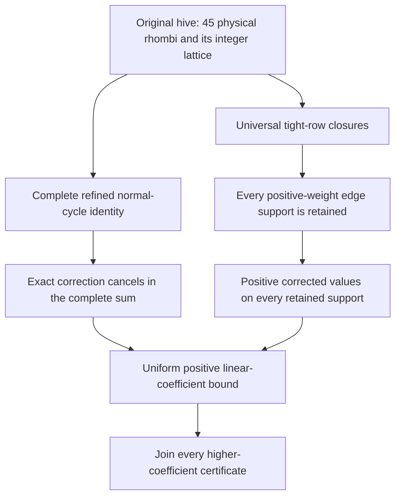

# Coefficient positivity through rank six

For partitions λ, μ and ν with λ outer, write

$$P(t)=c^{t\lambda}_{t\mu,t\nu}=\sum_k c_k t^k.$$

**Every ordinary coefficient is nonnegative when all three partitions have
length at most six, at every size and boundary.** The result uses the complete
original hive and its saturated lattice, including empty and point cases,
padding, nonsimple cones, hidden affine strata and actual degree drops.

The new linear-coefficient bound is

$$c_1(H)\geq\frac{1}{2\,000\,000}
\sum_{E\text{ an actual edge of }H}\operatorname{length}_{\mathbb Z}(E).$$

It is strict whenever the nonempty hive has positive dimension. This joins the
complete higher-coefficient certificates. A compact independent top-coefficient
calculation strengthens the conclusion: **every coefficient through the actual
degree is strictly positive for a nonempty hive**. Point hives have polynomial
one; empty positive-stretch families have polynomial zero. Complete exact
finite checks and the integrated mathematical review have passed.

This is a computer-assisted proof with exact arithmetic and independent
implementations. It is not a proof-assistant formalization or a claim of human
peer review. Rank seven and unrestricted KTT positivity remain open.

## Read and verify

| Purpose | Entry point |
| --- | --- |
| Understand the whole argument | [Complete proof account](PROOF.md) and [preprint source](../../papers/rank-six/README.md) |
| Inspect the decisive new idea | The support lemma and family-dependent sign theorem in the proof |
| Explore the strengthened geometry | [Legal realization, the 103-identity closure calculus and exact witness API](GEOMETRY.md) |
| Check the finite premises | [Verification guide](VERIFYING.md) and [portable tools](../../tooling/whole_rank_six/README.md) |
| Understand what changed | [Contributions and source lineage](CONTRIBUTIONS.md), [related work and novelty limits](NOVELTY.md) |
| Inspect formal-verification obligations | [Formalization assessment](FORMALIZATION.md) |

## Why the realizability restriction matters

The local Euler–Maclaurin formula expresses the linear coefficient as actual
edge lengths weighted by local constants. Some constants are negative. A
correction field changes the local values while its complete weighted sum
cancels, by primitive lattice balance around the two-faces.

An earlier search constrained every abstract independent nine-normal support.
Many of those supports cannot contribute to an actual hive edge: making their
physical rows tight forces a tenth independent interior equality. The new
proof discards their **sign constraints**, after proving their actual edge
weights are zero. It keeps the complete coefficient identity and every
correction incidence. A rational field is then positive on all retained
supports. Failure of the earlier search is not a proof that its unpruned system
is infeasible.

The complete domain has 27,230,728 nine-normal orbit rows. All 46,327,714
physical-row branches are checked. The retained set has 13,325,662 rows,
representing 79,940,357 original supports. The exact minimum is

$$\frac{40142888690844119591010700379369}
{40149066134252712057708583296000000000}.$$

These finite numbers support an all-size theorem only through the geometric
proof. They are not a census of boundary triples.

## Original contribution and antecedents

The realizability route was proposed and developed with Opus 5.5 in a
Fable-orchestrated investigation, then independently adopted and checked in
the Codex campaign. The full argument builds on earlier complete normal-cycle,
lattice, scalar and higher-coefficient work. Ferudun's rank-five theorem and
normal-correction approach, the hive correspondence, LR polynomiality and
Berline–Vergne theory are credited mathematical antecedents. The
[contribution map](CONTRIBUTIONS.md) separates those roles.

Publication strengthening adds a constructive legal-realization converse at
every rank and a complete 103-identity presentation of rank-six closure. Its
small independent certificate covers all `2^45` physical-row sets in about
five seconds. The [geometry page](GEOMETRY.md) states the exact quantifiers,
explains the proof, and links executable constructions.

[All results](../../RESULTS.md) · [Research process](../../AI-ASSISTANCE.md) ·
[Main page](../../README.md)
